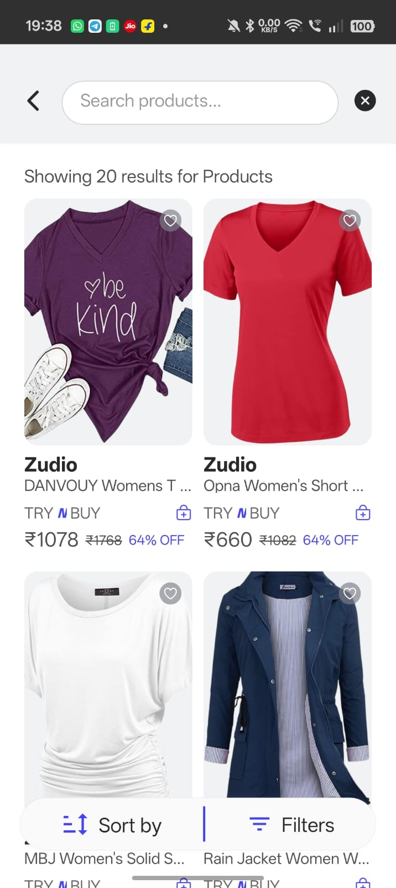
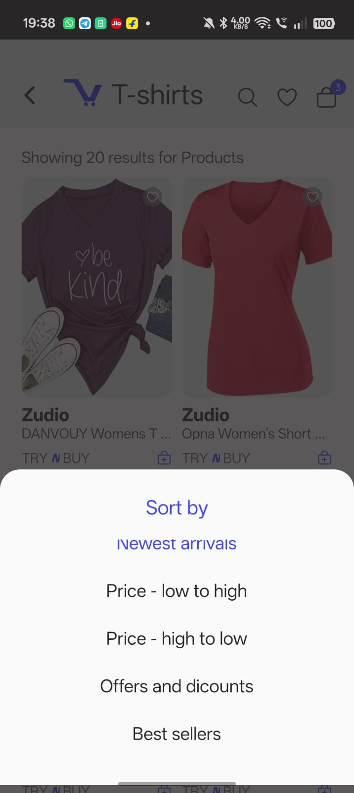
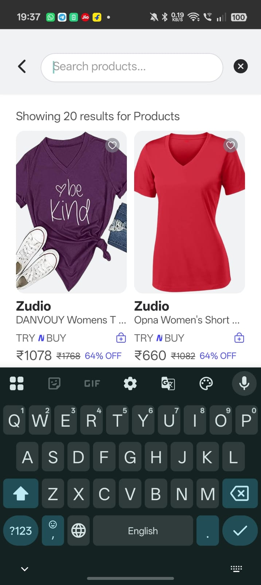
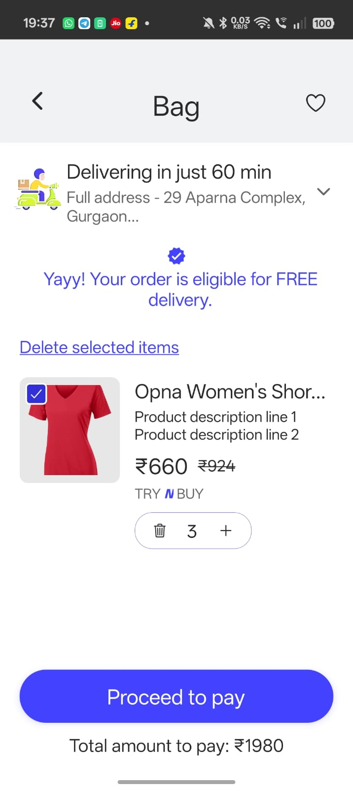
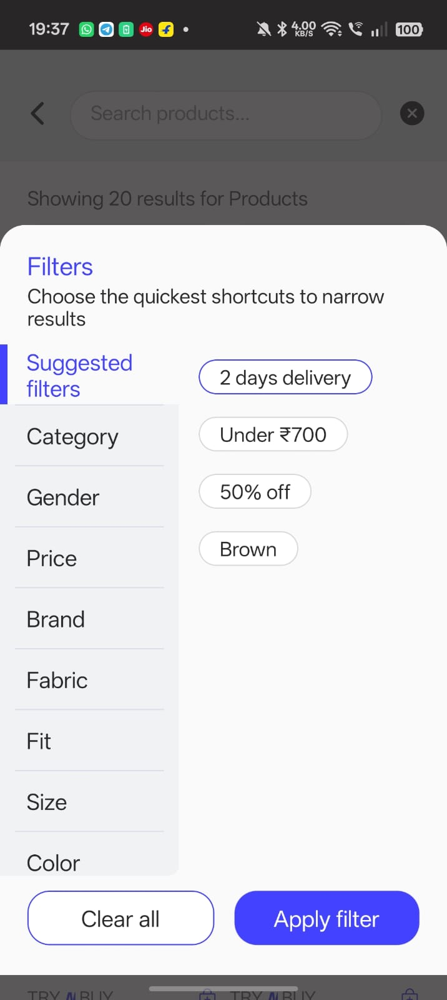
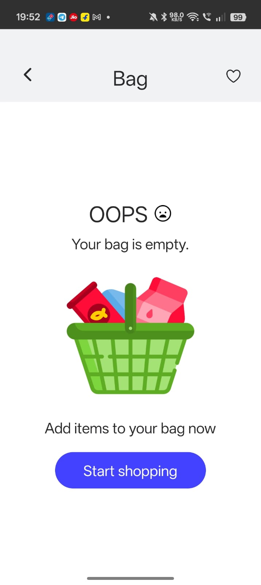

<div align="center">

  
  
  # 🛍️ E-Commerce Native App

  **A modern, lightning-fast e-commerce experience built with React Native and Expo.**

  [](https://reactnative.dev/)
  [](https://expo.dev/)
  [](https://redux-toolkit.js.org/)
  [](https://reactnavigation.org/)

  <p align="center">
    <a href="#-features">Features</a> •
    <a href="#-quick-start">Quick Start</a> •
    <a href="#-screenshots">Screenshots</a> •
    <a href="#-tech-stack">Tech Stack</a> •
    <a href="#-project-structure">Project Structure</a> •
    <a href="#-contact--support">Contact</a>
  </p>

</div>

---

## ✨ Features

Deliver a premium shopping experience right to your users' hands. This app is designed for speed, usability, and modern aesthetics.

- 📱 **Cross-Platform**: Runs natively on both iOS and Android.
- 🎨 **Modern UI/UX**: Clean, responsive, and intuitive design tailored for modern devices.
- 🛒 **Seamless Shopping Cart**: Robust state management ensuring items stay in the bag, even after restarting the app.
- ⚡ **Lightning Fast**: Optimized performance using the latest React Native architecture.
- 🔍 **Filtering & Sorting**: Easily find products with intuitive modal controls.
- 💾 **Persistent Data**: Powered by `@react-native-async-storage/async-storage` and `redux-persist`.

---

## 🚀 Quick Start

Get the app running locally in minutes.

### Prerequisites

Ensure you have the following installed on your machine:

*   [Node.js](https://nodejs.org/) (v18 or higher recommended)
*   [Git](https://git-scm.com/)
*   [Expo CLI](https://docs.expo.dev/get-started/installation/)
*   iOS Simulator (via Xcode) or Android Emulator (via Android Studio)

### Installation

1. **Clone the repository**
   ```bash
   git clone https://github.com/YOUR_USERNAME/e-commerce-app.git
   cd e-commerce-app
   ```

2. **Install dependencies**
   ```bash
   npm install
   ```

3. **Start the Expo development server**
   ```bash
   npm start
   ```

### Running the App

After running `npm start`, you'll see a QR code in your terminal. You can:

*   **📱 Physical Device:** Scan the QR code using the [Expo Go app](https://expo.dev/client) on your iOS or Android device.
*   **🍎 iOS Simulator:** Press `i` in the terminal to open the app in the iOS simulator.
*   **🤖 Android Emulator:** Press `a` in the terminal to open the app in the Android emulator.

---

## 📸 Screenshots

Get a glimpse of the sleek and intuitive user interface designed for an effortless shopping experience.

<div align="center">
  <table>
    <tr>
      <td align="center"><b>Home / Catalog</b></td>
      <td align="center"><b>Filtering</b></td>
      <td align="center"><b>Search Bar</b></td>
    </tr>
    <tr>
      <td></td>
      <td></td>
      <td></td>
    </tr>
    <tr>
      <td align="center"><b>Shopping Bag</b></td>
      <td align="center"><b>Checkout</b></td>
      <td align="center"><b>Empty Bag</b></td>

      <td></td>
    </tr>
    <tr>
      <td></td>
      <td></td>
      <td></td>
      <td></td>
    </tr>
  </table>
</div>

---

## 🛠️ Tech Stack

This project is built using industry-standard tools to ensure scalability and maintainability.

| Technology | Description |
| :--- | :--- |
| **[React Native](https://reactnative.dev/)** | Framework for building native apps using React. |
| **[Expo](https://expo.dev/)** | Toolchain and platform for universal React applications. |
| **[Redux Toolkit](https://redux-toolkit.js.org/)** | Predictable state container for managing the shopping cart. |
| **[React Navigation](https://reactnavigation.org/)** | Routing and navigation for Expo and React Native apps. |
| **[Axios](https://axios-http.com/)** | Promise-based HTTP client for external API requests. |

---

## 📂 Project Structure

```text
src/
├── components/   # Reusable UI components (Buttons, Cards, Modals)
├── redux/        # State management (Store, Slices)
├── screens/      # Main application views (Products, Cart)
└── utils/        # Helper functions and API configurations
```

---

## 🤝 Contact & Support

Designed and developed with ❤️. If you have any questions, business inquiries, or want to collaborate, feel free to reach out!

<div align="center">
  
  **Samrat Samanta** • *UI Designer & Mobile Developer*
  
  [](https://github.com/Samrat-87)
  [](https://www.linkedin.com/in/samrat-samanta/)
  [](mailto:samratsamanta018@gmail.com)
  [](https://samratsamanta.me/)

</div>

<p align="center">
  <small>© 2026 E-Commerce App. All rights reserved.</small>
</p>
